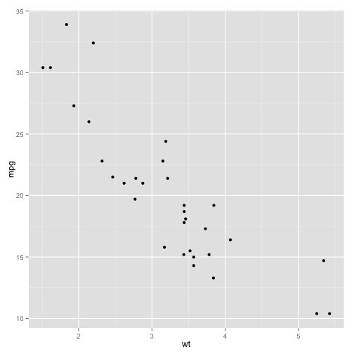

# Slidify
### Reproducible Slides

---

## Title

This is a slide

- point 1
- point 2
- point 3


---

## Code with slide


```r
library(ggplot2)
qplot(wt, mpg, data = mtcars)
```

 


--- &vertical

## Vertical Slides

The next set of slides will be vertical slides.

***

## Slide 1

This is slide 1

***

## Slide 2

<iframe src='http://www.statdistributions.com' width = '960px' height = '600px'></iframe>

